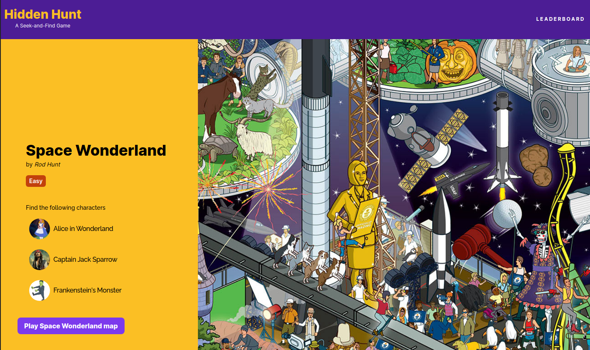
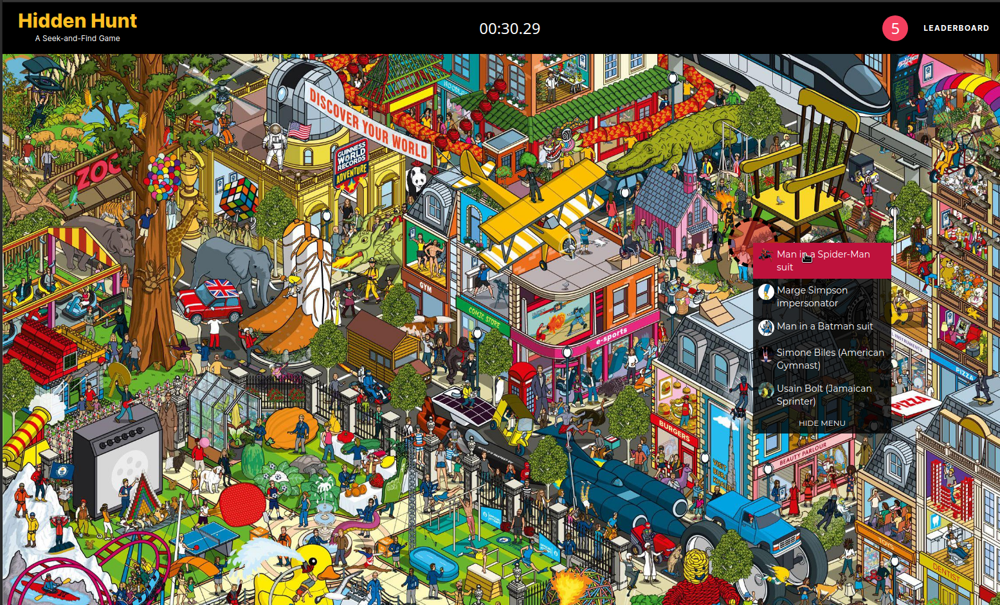
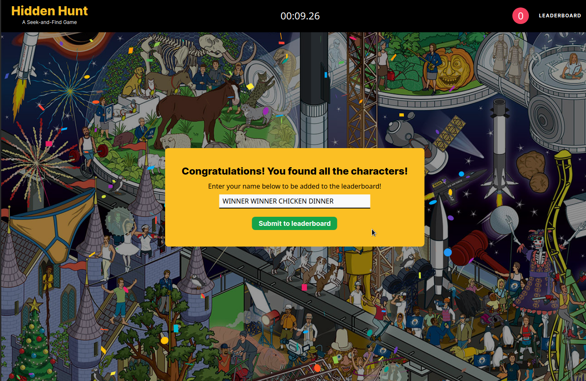

# Project: Hidden Hunt

[**Live version** of the app can be found here](https://hidden-hunt.vercel.app/)

**Hidden Hunt** is a seek-and-find game based on the popular _Where's Waldo_ children's book series. You are given a set of characters to seek within a map and you win by finding all of them in the shortest amount of time.

### Features

1. **Three Maps**: The game features three maps with different difficulty levels. All character coordinates are retrieved from the back-end(Firestore) to prevent front-end leaks.

2. **Leaderboard**: A leaderboard for each map is hosted on Firestore--displaying the users with the fasted completion times.

### Technologies Used

- Typescript
- Vite + React
- React Router
- TailwindCSS
- Firebase (Firestore)

### Credits/Acknowledgments

This project is for personal use only. I do not own any of the rights for the assets used in this project.

The maps used in this project are from the illustrator Rod Hunt. [You can check out more of his amazing works here.](https://rodhunt.com/illustration)

### Display

Home Page

Game Page

Game Win Modal

### Notes

Completed the main functionality of this app in three days (coordinate matching, reading from/posting to the database, create stopwatch timer, etc.)

### To-do

1. Add more features to populate the home page.

2. For mobile, make the image map span the entire screen and allow users to drag/pan/zoom through the image.

---

Developed by **Renchester Ramos**
